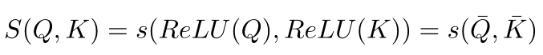
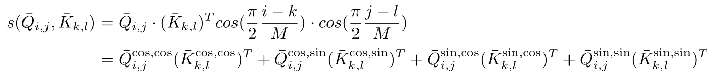

# CosAttention2D

## Introduction

I designed a 2D cosine attention module inspired by [cosFormer: Rethinking Softmax in Attention](https://arxiv.org/abs/2202.08791).
It can be used to apply self-attention on grid features (for example, like how the self-attention used in the encoder of DETR) with linear time complexity. I've tested the module on some task I'm familiar with, and found that it improved the accuracy while reducing both time and space complexity, compared with the traditional self-attention module of Transformer. 

## More Details 

Like the original paper, the similarity function (i.e., attention) is defined as:

<p align="center">
  
</p>
For the tokens of specific positions in the query and key, we define:
<p align="center">
  
</p>

All the notation is the same as the original paper, except that `(i, j)` and `(k, l)` mean the 2D coordinates of the tokens in the query grid and key grid, respectively. Now we can adjust the multiplication order of `KQV` and perform the calculation in linear complexity. (P.S. I also tested the version that neglects two middle terms in the above decomposition formula, and get lower accuracy but faster computation.)

## Usage

You can use the module defined in the `cos_attn2d.py` to perform the calculation described above. Note that this module contains no learnable parameters.

There is also a simple user case defined in the `cos_mhsa.py` which can be used to perform the CosAttention2d in a multi-head setting.

You are free to use and modify these scripts. Any feedback or discussion is welcome.

## Acknowledgment

I appreciate [performer_pytorch](https://github.com/lucidrains/performer-pytorch) and [cosFormer](https://github.com/OpenNLPLab/cosFormer) for their valuable contributions.

## Citation

```
@inproceedings{
  zhen2022cosformer,
  title={cosFormer: Rethinking Softmax In Attention},
  author={Zhen Qin and Weixuan Sun and Hui Deng and Dongxu Li and Yunshen Wei and Baohong Lv and Junjie Yan and Lingpeng Kong and Yiran Zhong},
  booktitle={International Conference on Learning Representations},
  year={2022},
  url={https://openreview.net/forum?id=Bl8CQrx2Up4}
}
```
